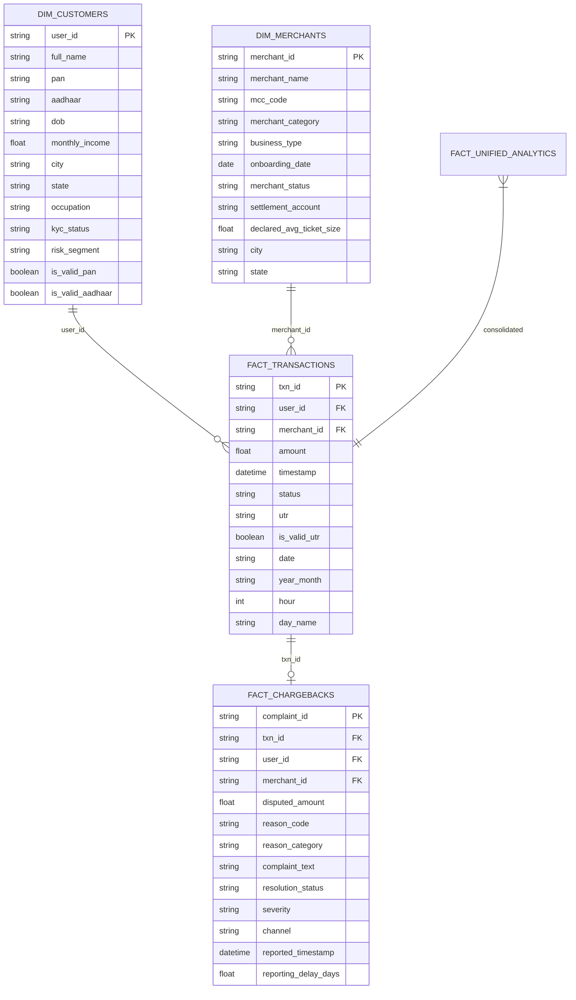

# 📖 Data Dictionary — FinTech & BFSI Analytics Platform

**Track 1: UPI Fraud Ring & Merchant Analytics**  
**TransOrg AgentIQ Datathon**

---

## 🏛️ Data Architecture Overview

The platform extracts messy raw synthetic payments, customer identity, merchant onboarding, and dispute logs, normalizes all entities, and structures them into an analytics-grade **Star Schema Data Mart** persisted in **Parquet**, **CSV**, and an **Indexed SQLite Database (`fintech_analytics.db`)**.



---

## 1. `fact_transactions` (Core Payment Events)

| Column Name | Physical Type | Logical Type | Nullable | Key | Example Value | Cleaning & Validation Rule | Business Definition |
|---|---|---|:---:|:---:|---|---|---|
| `txn_id` | `VARCHAR(32)` | Identifier | No | **PK** | `TXN00000001` | Normalized to standard `TXN{8-digits}` regex format. | Unique payment transaction identifier across UPI rails. |
| `user_id` | `VARCHAR(32)` | Identifier | No | **FK** | `USR00142` | Extracted numeric digits and standardized to canonical `USR{5-digits}`. | Unique identifier of the initiating customer. |
| `merchant_id` | `VARCHAR(32)` | Identifier | No | **FK** | `MCH0124` | Extracted numeric digits and standardized to canonical `MCH{4-digits}`. | Unique identifier of the recipient merchant entity. |
| `amount` | `DOUBLE PRECISION` | Currency (INR) | No | - | `12450.50` | Stripped `₹`, `Rs`, `INR`, commas, multiplier suffixes (`k`/`m`), converted negative to absolute. | Net transactional monetary value settled in Indian Rupees. |
| `timestamp` | `TIMESTAMP (ns)` | Datetime | No | - | `2024-03-14 18:22:10` | Unified epoch timestamps (seconds & milliseconds) and ISO/12h mixed strings. | Exact payment initiation timestamp. |
| `status` | `VARCHAR(16)` | Enum | No | - | `SUCCESS` | Mapped synonyms (`COMPLETED`, `PAID` -> `SUCCESS`; `FAIL`, `DECLINED` -> `FAILED`; `PROCESSING` -> `PENDING`). | Transaction clearance status (`SUCCESS`, `FAILED`, `PENDING`). |
| `utr` | `VARCHAR(32)` | Reference | Yes | - | `UTR1928374650` | Stripped hyphens and whitespace; standardized `UTR` prefix format. | Unique Transaction Reference number issued by NPCI banking switch. |
| `is_valid_utr` | `BOOLEAN` | Quality Flag | No | - | `True` | Evaluated against `^UTR\d{10,12}$` structural pattern. | Data quality indicator for auditing UTR integrity. |
| `date` | `VARCHAR(10)` | Date | No | - | `2024-03-14` | Extracted ISO date (`YYYY-MM-DD`) for time-series indexing. | Transaction calendar date. |
| `year_month` | `VARCHAR(7)` | Period | No | - | `2024-03` | Extracted monthly cohort period. | Year and month for financial reconciliation. |
| `hour` | `INTEGER` | Time | No | - | `18` | Extracted hour of transaction (`0` to `23`). | Hour of day for fraud spike and failure rate analysis. |
| `day_name` | `VARCHAR(16)` | Calendar | No | - | `Thursday` | Extracted day of week string. | Day of week for weekly velocity analysis. |

---

## 2. `dim_customers` (Customer KYC Master)

| Column Name | Physical Type | Logical Type | Nullable | Key | Example Value | Cleaning & Validation Rule | Business Definition |
|---|---|---|:---:|:---:|---|---|---|
| `user_id` | `VARCHAR(32)` | Identifier | No | **PK** | `USR00142` | Canonical `USR{5-digits}` standardization; deduplicated to latest verified state. | Master unique customer ID. |
| `full_name` | `VARCHAR(128)` | Text | No | - | `Aarav Sharma` | Stripped irregular whitespace and special characters. | Legal full name of the account holder. |
| `pan` | `VARCHAR(16)` | Identity Key | Yes | - | `ABCDE1234F` | Uppercased, removed spaces/hyphens, validated via `^[A-Z]{5}\d{4}[A-Z]$`. | Indian Permanent Account Number (Tax ID). |
| `aadhaar` | `VARCHAR(20)` | Identity Key | Yes | - | `XXXX-XXXX-9816` | Standardized to masked 12-digit format `XXXX-XXXX-NNNN` for privacy. | Masked 12-digit Aadhaar UID number. |
| `dob` | `VARCHAR(10)` | Date | Yes | - | `1992-05-18` | Standardized date string parsing. | Customer Date of Birth. |
| `monthly_income`| `DOUBLE PRECISION`| Currency (INR) | Yes | - | `75000.00` | Parsed numeric income ranges and stripped currency symbols. | Declared monthly income in INR. |
| `city` | `VARCHAR(64)` | Geography | No | - | `Mumbai` | Canonical city mapping (`BOMBAY` -> `Mumbai`, `BLR` -> `Bengaluru`, etc.). | Primary residential city. |
| `state` | `VARCHAR(64)` | Geography | No | - | `Maharashtra`| Harmonized state mapping aligned with normalized city. | Primary residential state. |
| `occupation` | `VARCHAR(64)` | Category | Yes | - | `Salaried` | Standardized occupational category (`Salaried`, `Self-Employed`, `Business`, `Student`). | Employment / occupation type. |
| `kyc_status` | `VARCHAR(16)` | Enum | No | - | `VERIFIED` | Standardized to `VERIFIED`, `PENDING`, `REJECTED`, or `UNREGISTERED`. | Identity verification clearance status. |
| `risk_segment` | `VARCHAR(16)` | Enum | No | - | `LOW` | Standardized to `LOW`, `MEDIUM`, `HIGH`, `CRITICAL`, or `UNKNOWN`. | Risk classification assigned during onboarding underwriting. |
| `is_valid_pan` | `BOOLEAN` | Quality Flag | No | - | `True` | Regex validation check against income tax format. | Flag indicating whether PAN adheres to official structure. |
| `is_valid_aadhaar`| `BOOLEAN` | Quality Flag | No | - | `True` | Format check for 12-digit numeric length. | Flag indicating valid Aadhaar format. |

---

## 3. `dim_merchants` (Merchant Master Registry)

| Column Name | Physical Type | Logical Type | Nullable | Key | Example Value | Cleaning & Validation Rule | Business Definition |
|---|---|---|:---:|:---:|---|---|---|
| `merchant_id` | `VARCHAR(32)` | Identifier | No | **PK** | `MCH0124` | Canonical `MCH{4-digits}` standardization; deduplicated on onboarding. | Master unique merchant ID. |
| `merchant_name` | `VARCHAR(128)` | Text | No | - | `Reliance Fresh 102`| Cleansed trade and business name strings. | Registered trade name of the merchant. |
| `mcc_code` | `VARCHAR(8)` | Financial Code | No | - | `5411` | Harmonized with 4-digit ISO 18245 standard; imputed from category name when missing. | Merchant Category Code (MCC). |
| `merchant_category`| `VARCHAR(64)`| Category | No | - | `Grocery Stores` | Standardized to 10 canonical merchant business categories. | Business classification of the merchant. |
| `business_type` | `VARCHAR(32)` | Enum | No | - | `Private Ltd` | Standardized (`Proprietorship`, `Partnership`, `Private Ltd`, `Public Ltd`). | Legal corporate entity structure. |
| `onboarding_date`| `VARCHAR(10)` | Date | No | - | `2023-08-11` | Standardized ISO date parsing. | Date merchant was approved on the platform. |
| `merchant_status`| `VARCHAR(16)` | Enum | No | - | `ACTIVE` | Standardized to `ACTIVE`, `SUSPENDED`, `ON_HOLD`, or `INACTIVE`. | Merchant operational status. |
| `settlement_account`| `VARCHAR(64)`| Bank Account | Yes | - | `ACC_9876543210`| Cleaned account string; used to construct knowledge graph settlement edges. | Bank settlement account identifier. |
| `declared_avg_ticket_size`| `DOUBLE PRECISION`| Currency (INR)| Yes | - | `850.00` | Normalized numerical value; used for ticket size anomaly divergence checks. | Merchant's self-declared average transaction ticket size. |
| `city` | `VARCHAR(64)` | Geography | No | - | `Bengaluru` | Canonical city mapping. | Operating city location. |
| `state` | `VARCHAR(64)` | Geography | No | - | `Karnataka` | Harmonized state mapping. | Operating state location. |

---

## 4. `fact_chargebacks` (Disputes & Fraud Complaints)

| Column Name | Physical Type | Logical Type | Nullable | Key | Example Value | Cleaning & Validation Rule | Business Definition |
|---|---|---|:---:|:---:|---|---|---|
| `complaint_id` | `VARCHAR(32)` | Identifier | No | **PK** | `CBK0001249` | Normalized to standard `CBK{7-digits}` format. | Unique dispute complaint identifier. |
| `txn_id` | `VARCHAR(32)` | Identifier | No | **FK** | `TXN00008821` | Standardized and verified against transaction records. | Disputed transaction ID. |
| `user_id` | `VARCHAR(32)` | Identifier | No | **FK** | `USR00142` | Extracted from JSON complaint record and standardized. | Customer raising the dispute. |
| `merchant_id` | `VARCHAR(32)` | Identifier | No | **FK** | `MCH0124` | Extracted from JSON complaint record and standardized. | Merchant entity being disputed. |
| `disputed_amount`| `DOUBLE PRECISION`| Currency (INR)| No | - | `12450.50` | Cleansed currency string; imputed from original transaction amount if missing. | Disputed monetary claim amount. |
| `reason_code` | `VARCHAR(16)` | Code | Yes | - | `RC_UNAUTHORIZED` | Standardized reason code string. | Bank/Network chargeback reason code. |
| `reason_category`| `VARCHAR(64)` | Category | No | - | `Unauthorized / Fraud`| Grouped into canonical categories (`Unauthorized / Fraud`, `Goods Not Delivered`, `Duplicate Billing`, `Technical Failure`). | High-level dispute categorization. |
| `complaint_text`| `TEXT` | Unstructured | Yes | - | `Money debited twice` | Stripped raw complaint customer narrative. | Customer's written grievance description. |
| `resolution_status`| `VARCHAR(32)`| Enum | No | - | `REFUNDED` | Standardized to `OPEN`, `UNDER_REVIEW`, `REFUNDED`, `REJECTED`, or `SETTLED`. | Current operational state of the dispute claim. |
| `severity` | `VARCHAR(16)` | Enum | No | - | `CRITICAL` | Mapped to `CRITICAL`, `HIGH`, `MEDIUM`, or `LOW`. | SLA urgency tier for dispute investigation. |
| `channel` | `VARCHAR(32)` | Category | No | - | `Mobile App` | Standardized (`Mobile App`, `Net Banking`, `Branch`, `Call Center`). | Customer channel used to lodge complaint. |
| `reported_timestamp`| `TIMESTAMP (ns)`| Datetime | No | - | `2024-03-22 10:15:00` | Mixed datetime parsing. | Timestamp when the dispute was officially filed. |
| `reporting_delay_days`| `DOUBLE PRECISION`| Time Delta | No | - | `7.65` | Computed as `(reported_timestamp - txn_timestamp).days`. | Calendar days elapsed between transaction and dispute filing. |

---

## 5. `fact_unified_analytics` (Denormalized Analytics Mart)

The unified analytics mart combines the Star Schema tables into a single high-performance analytical view:

```sql
SELECT 
    t.txn_id,
    t.user_id,
    t.merchant_id,
    t.amount,
    t.timestamp,
    t.status,
    t.utr,
    t.is_valid_utr,
    t.date,
    t.year_month,
    t.hour,
    t.day_name,
    COALESCE(c.is_disputed, FALSE) AS is_disputed,
    COALESCE(c.disputed_amount, 0.0) AS disputed_amount,
    c.complaint_id,
    c.reason_category,
    c.severity,
    c.resolution_status,
    c.reporting_delay_days,
    m.merchant_name,
    m.merchant_category,
    m.merchant_status,
    m.declared_avg_ticket_size,
    m.city AS merchant_city,
    m.state AS merchant_state,
    u.full_name,
    u.kyc_status,
    u.risk_segment,
    u.monthly_income,
    u.city AS customer_city,
    u.state AS customer_state
FROM fact_transactions t
LEFT JOIN fact_chargebacks c ON t.txn_id = c.txn_id
LEFT JOIN dim_merchants m ON t.merchant_id = m.merchant_id
LEFT JOIN dim_customers u ON t.user_id = u.user_id;
```

---

## 🔍 Data Quality Constraints & Validation Matrix

| Entity | Field | Rule | Imputation / Rescue Action |
|---|---|---|---|
| **Transactions** | `amount` | Must be numeric, positive | Stripped text/currency markers, multiplied `k` by $10^3$, imputed missing from dispute logs if present. |
| **Transactions** | `timestamp` | Must be valid datetime | Mixed parser handles epoch seconds, milliseconds, ISO, and AM/PM strings. |
| **Transactions** | `status` | Must be canonical enum | Unified 10+ raw synonym variations to `SUCCESS`, `FAILED`, or `PENDING`. |
| **Transactions** | `utr` | Length 10-12 alphanumeric | Stripped hyphens/spaces; flagged invalid formats for risk correlation. |
| **Customers** | `pan` | 10 char regex `[A-Z]{5}\d{4}[A-Z]` | Uppercased, stripped hyphens, validated without dropping customer row. |
| **Customers** | `aadhaar` | 12 digit format | Standardized to masked `XXXX-XXXX-NNNN` for PII protection. |
| **Customers** | `city` / `state` | Standard geographical name | Harmonized via 25+ city alias dictionary (e.g. Bombay -> Mumbai). |
| **Merchants** | `mcc_code` | 4-digit ISO code | Derived from merchant category if missing, and vice versa. |
| **Chargebacks** | `reporting_delay_days` | Float >= 0.0 | Calculated exact delta from transaction occurrence to dispute filing. |
