# 🛡️ AgentIQ: FinTech & BFSI — UPI Fraud Ring & Merchant Analytics

[](https://www.python.org/)
[](https://streamlit.io/)
[](https://plotly.com/)
[](https://networkx.org/)
[](https://www.sqlite.org/)
[]()
[](https://fintech-io.streamlit.app/)

An enterprise-grade analytics, graph intelligence, and conversational AI solution for **Track 1: FinTech & BFSI - UPI Fraud Ring & Merchant Analytics** (TransOrg AgentIQ Datathon).

> 🌐 **Live Web Application:** **[https://fintech-io.streamlit.app/](https://fintech-io.streamlit.app/)**  
> Instant access to real-time UPI transaction metrics, high-risk merchant risk scoring, interactive graph fraud rings, dynamic dataset-aware AI Copilot with Developer Mode, and interactive Plotly charts.

---

## 📑 Table of Contents
1. [Executive Overview](#-executive-overview)
2. [Architecture & Pipeline Flow](#-architecture--pipeline-flow)
3. [Datasets: Raw vs. Cleaned](#-datasets-raw-vs-cleaned)
4. [Data Cleaning & Normalization Strategies](#-data-cleaning--normalization-strategies)
5. [Relational Data Model (Star Schema)](#-relational-data-model-star-schema)
6. [Core Business & Risk Metrics](#-core-business--risk-metrics)
7. [Graph-First AI Agent & Fraud Ring Detection](#-graph-first-ai-agent--fraud-ring-detection)
8. [Interactive Dashboard Features](#-interactive-dashboard-features)
9. [Key Business & Fraud Insights](#-key-business--fraud-insights)
10. [Project Directory Structure](#-project-directory-structure)
11. [Installation & Setup](#-installation--setup)
12. [How to Run & Verify](#-how-to-run--verify)

---

## 🌟 Executive Overview

Digital payment networks like Unified Payments Interface (UPI) process billions of transactions monthly. Identifying coordinated fraud rings, collusive merchant syndicates, mule settlement accounts, and suspicious dispute spikes requires robust data cleaning, high-performance relational modeling, graph theory algorithms, and conversational AI interfaces.

This repository implements an end-to-end pipeline that:
- **Cleans & Normalizes** 4 messy synthetic FinTech datasets without arbitrary row deletion.
- **Constructs an Analytics-Ready Star Schema** stored in Parquet, CSV, and indexed SQLite DB.
- **Computes 16+ Core Business & Risk Metrics** covering payment flow health, merchant risk, and KYC integrity.
- **Employs a Graph-First Engine (NetworkX)** with 52,045 nodes and 22,587 edges to detect mule settlement accounts and collusive fraud syndicates.
- **Powers a Modern Streamlit + Plotly Dashboard** featuring interactive ego networks, heatmaps, and an **AgentIQ AI Assistant** answering complex natural language queries.

---

## 🏗️ Architecture & Pipeline Flow

```mermaid
flowchart TD
    subgraph RawData [Raw Synthetic Datasets]
        UPI[track1_upi_transactions.csv]
        KYC[track1_kyc_records.csv]
        MCH[track1_merchants_master.csv]
        CBK[track1_chargebacks.json]
    end

    subgraph Cleaning [Data Cleaning & Standardization Engine]
        C1[ID Standardizer: user_id, merchant_id, txn_id]
        C2[Mixed Datetime Parser: ISO, epoch, 12h/24h AM/PM]
        C3[Currency Normalizer: INR, Rs, ₹, commas, multipliers]
        C4[Status Normalizer: SUCCESS, FAILED, PENDING]
        C5[Identity Cleaners: PAN regex, Aadhaar masking, UTR format]
        C6[Entity Canonicalizers: MCC mapping, City/State harmonization]
    end

    subgraph StarSchema [Relational Data Mart & DB]
        DIM_USER[(dim_customers)]
        DIM_MCH[(dim_merchants)]
        FACT_TXN[(fact_transactions)]
        FACT_DISP[(fact_chargebacks)]
        CONSOL[(fact_unified_analytics)]
        SQLITE[(fintech_analytics.db)]
    end

    subgraph AnalyticsEngine [Business & Risk Engine]
        KPI[16+ Executive KPIs]
        MCH_RISK[Merchant Risk Scoring & Spikes]
        KYC_FUNNEL[KYC Conversion & Rejections]
        DISP_ANALYTICS[Dispute SLAs & Delayed Reporting]
    end

    subgraph GraphAI [Graph-First AI Agent]
        GRAPH[NetworkX Heterogeneous Payment Graph]
        MULE[Shared Settlement Account Ring Detector]
        SYNDICATE[Collusive Bipartite Syndicate Detector]
        NLP_AGENT[AgentIQ Natural Language Assistant]
    end

    subgraph WebApp [Interactive Streamlit Dashboard]
        TAB1[Executive Overview & Volume Trends]
        TAB2[Merchant & Category Risk Matrix]
        TAB3[Customer 360 & KYC Funnel]
        TAB4[Disputes & Chargeback Root Causes]
        TAB5[Interactive Fraud Ring Graph Visualizer]
        TAB6[AgentIQ Conversational AI Chat]
    end

    RawData --> Cleaning
    Cleaning --> StarSchema
    StarSchema --> AnalyticsEngine
    StarSchema --> GraphAI
    AnalyticsEngine --> WebApp
    GraphAI --> WebApp
```



---

## 📊 Datasets: Raw vs. Cleaned

| Dataset | Raw File | Cleaned Table | Record Count | Description |
|---|---|---|:---:|---|
| **UPI Transactions** | `track1_upi_transactions.csv` | `fact_transactions` | **20,000** | Core payment logs with amounts, timestamps, UTRs, and status. (400 exact duplicates deduplicated). |
| **Customer KYC** | `track1_kyc_records.csv` | `dim_customers` | **28,920** | Master customer identities with PAN, Aadhaar, DOB, city, income, and KYC status. |
| **Merchant Master** | `track1_merchants_master.csv` | `dim_merchants` | **4,343** | Merchant business data, MCC codes, categories, settlement accounts, and declared ticket sizes. |
| **Disputes / Chargebacks** | `track1_chargebacks.json` | `fact_chargebacks` | **2,800** | Customer complaints, dispute reasons, severity levels, and bank response SLAs. |
| **Unified Analytics Mart** | *Generated* | `fact_unified_analytics` | **20,000** | Denormalized star-schema view joining transactions, disputes, customers, and merchants. |

---

## 🧹 Data Cleaning & Normalization Strategies

Implemented in [`src/data_cleaning.py`](file:///d:/Projects/datathon/src/data_cleaning.py):

1. **User ID Normalization (`standardize_user_id`)**:
   - Converts variations (`USR12345`, `usr12345`, `USR-12345`, `USR 12345`, `usr_12345`, `12345`) into canonical `USR{5-digits}` (e.g. `USR12345`).
2. **Merchant ID Normalization (`standardize_merchant_id`)**:
   - Standardizes variations (`MCH1234`, `mch1234`, `MCH-1234`, `MCH 1234`, `1234`) into canonical `MCH{4-digits}` (e.g. `MCH1234`).
3. **Currency & Amount Parsing (`clean_amount`)**:
   - Strips currency tokens (`₹`, `Rs.`, `Rs`, `INR`, `$`, commas, and whitespace).
   - Handles unit multipliers (`'27.3k'` -> `27300.0`, `'1.2m'` -> `1200000.0`).
   - Resolves negative amounts to absolute magnitude without dropping records.
4. **Robust Mixed Datetime Parser (`parse_mixed_datetime_series`)**:
   - Handles epoch timestamps in seconds and milliseconds, including negative epoch timestamps (e.g. DOBs prior to 1970 like `-306872948` -> `1960-04-10`).
   - Parses ISO `YYYY-MM-DD`, 12-hour AM/PM formats, and slash-separated dates (`DD/MM/YYYY`, `MM/DD/YYYY`).
5. **Transaction Status Normalization (`normalize_txn_status`)**:
   - `SUCCESS`: `SUCCESS`, `Success`, `TXN_SUCCESS`, `COMPLETED`, `S`
   - `FAILED`: `FAILED`, `Fail`, `TXN_FAILED`, `Declined`, `F`
   - `PENDING`: `PENDING`, `Pending`, `PROCESSING`, `Initiated`
6. **UTR Cleaning & Integrity Flagging (`clean_utr`)**:
   - Standardizes `UTR{10-12 digits}`, cleans whitespace and hyphens, and flags format validity for correlation analysis.
7. **KYC Fields & Identity Cleaning**:
   - **PAN**: Uppercase conversion, regex validation `^[A-Z]{5}\d{4}[A-Z]$`.
   - **Aadhaar**: Normalizes 12-digit numbers and masked patterns (`XXXX-XXXX-1234`).
   - **City / State**: Canonical city harmonization (`Bombay` -> `Mumbai`, `BLR` -> `Bengaluru`, `Calcutta` -> `Kolkata`, `Madras` -> `Chennai`, `Dilli` -> `Delhi`, `Hyd` -> `Hyderabad`, `ASR` -> `Amritsar`, `JPR` -> `Jaipur`) with state mapping.
   - **KYC Status**: Standardizes into `VERIFIED`, `PENDING`, `REJECTED`.
8. **MCC & Merchant Category Harmonization (`clean_mcc`)**:
   - Cleans 4-digit MCC codes and maps 82 raw category variants into 10 canonical categories (`Grocery Stores`, `Restaurants & Dining`, `Pharmacies & Healthcare`, `Hotels & Lodging`, `Transportation`, `Apparel & Clothing`, `Department Stores`, `Telecommunication Services`, `Books & Stationery`, `Miscellaneous Retail`).
9. **Chargebacks JSON Processing & Imputation (`clean_chargebacks`)**:
   - Resolves reason codes into standard categories (`Unauthorized / Fraud / ATO`, `Goods / Services Not Delivered`, `Duplicate / Technical Debit`, `Customer Dispute`).
   - Imputes missing disputed amounts from the corresponding `Fact Transaction` amount where `txn_id` matches.
   - Computes dispute reporting delay interval: `Delay (days) = reported_timestamp - transaction_timestamp`.

---

## 🗄️ Relational Data Model (Star Schema)

The clean data model is exported to `data_cleaned/` in **Parquet**, **CSV**, and an indexed **SQLite database (`fintech_analytics.db`)**.

```
                           +---------------------------+
                           |       dim_customers       |
                           +---------------------------+
                           | * user_id (PK)            |
                           |   full_name               |
                           |   pan, is_valid_pan       |
                           |   aadhaar                 |
                           |   city, state             |
                           |   monthly_income          |
                           |   kyc_status              |
                           |   risk_segment            |
                           +-------------+-------------+
                                         |
                                         | 1:N
                                         v
+--------------------------+  N:1  +---------------------------+  1:1  +--------------------------+
|      dim_merchants       |<------+     fact_transactions     +------>|     fact_chargebacks     |
+--------------------------+       +---------------------------+       +--------------------------+
| * merchant_id (PK)       |       | * txn_id (PK)             |       | * complaint_id (PK)      |
|   merchant_name          |       |   timestamp               |       |   txn_id (FK)            |
|   mcc                    |       |   user_id (FK)            |       |   user_id (FK)           |
|   merchant_category      |       |   merchant_id (FK)        |       |   merchant_id (FK)       |
|   business_type          |       |   amount                  |       |   disputed_amount        |
|   city, state            |       |   utr, is_valid_utr       |       |   reason_category        |
|   merchant_status        |       |   status                  |       |   severity               |
|   settlement_account     |       +---------------------------+       |   reporting_delay_days   |
+--------------------------+                                           +--------------------------+
```

---

## 📈 Core Business & Risk Metrics

All metrics are calculated via [`AnalyticsEngine`](file:///d:/Projects/datathon/src/analytics_engine.py):

| Business Metric | Value | Reference / Context |
|---|---|---|
| **Total Transaction Count** | **20,000** | Clean, deduplicated UPI transaction volume |
| **Total Transaction Volume** | **₹24,97,72,508.82** (~₹24.98 Cr) | Sum of all processed transaction amounts |
| **Average Transaction Value (ATV)** | **₹12,488.63** | Mean ticket size across payment network |
| **Payment Success Rate** | **85.27%** (17,054 txns) | Standard UPI payment success benchmark |
| **Payment Failure Rate** | **9.78%** (1,956 txns) | Concentrated during nighttime / off-peak processing hours |
| **Pending Transaction Rate** | **4.96%** (990 txns) | Transient processing / settlement delays |
| **Total Chargeback Count** | **2,800** | Customer dispute complaints resolved to valid transactions |
| **Total Disputed Volume** | **₹1,00,73,050.05** (~₹1.01 Cr) | Mean disputed amount ₹3,597.52 |
| **Overall Dispute Ratio** | **14.00%** | Ratio of chargebacks to total transactions |
| **KYC Completion Rate** | **77.17%** (22,317 users) | Fully verified customer profiles |
| **KYC Rejection Rate** | **8.21%** (2,374 users) | Highest correlation with chargebacks and fraud |
| **Avg Dispute Reporting Delay** | **19.87 Days** | Average time between transaction date and complaint filing |
| **Disputes Reported > 7 Days** | **694 cases (24.79%)** | Key indicator of Account Takeover (ATO) & syndicated fraud |

---

## 🕸️ Graph-First AI Agent & Fraud Ring Detection

Implemented in [`src/graph_agent.py`](file:///d:/Projects/datathon/src/graph_agent.py) using **NetworkX**:

- **Graph Structure**:
  - **52,045 Total Nodes**: Customers (`USRxxxxx`), Merchants (`MCHxxxx`), and Settlement Accounts (`ACCxxxx`).
  - **22,587 Total Edges**: Transaction relations with weighted attributes (`total_amount`, `txn_count`, `dispute_count`, `disputed_amount`, `has_dispute`) and settlement routes (`SETTLES_TO`).
- **Fraud Detection Algorithms**:
  1. **Mule Settlement Account Rings**: Detects distinct merchants sharing identical settlement accounts, exposing disposable storefront syndicates.
  2. **Collusive Bipartite Clusters**: Connected component clustering identifying groups of unverified/rejected users systematically transacting with high-dispute merchants.
  3. **Multi-Hop Ego Network Visualizer**: Extracts 1-hop and 2-hop neighborhoods around any customer or merchant for visual investigation in Plotly.

### AgentIQ Conversational NLP Assistant
The embedded AI Copilot interprets natural language queries and returns structured answers, formatted markdown takeaways, data tables, and dynamic charts for all questions:
1. *Daily transaction volume and value trends*
2. *Comparing successful, failed, and pending transactions*
3. *Performance & dispute metrics by merchant category*
4. *Top merchants by chargeback count and disputed volume*
5. *Chargeback reason code and severity SLA distributions*
6. *High-risk repeat-dispute customers*
7. *Average transaction value (ATV) trends over time*
8. *Transaction volume breakdown by customer KYC status*
9. *Disputes reported after long delays (>7 days)*
10. *Merchants with highest chargeback-to-transaction ratios*
11. *Automated fraud ring and mule syndicate detection*

---

## 🖥️ Interactive Dashboard Features

The Streamlit web application is deployed live at **[https://fintech-io.streamlit.app/](https://fintech-io.streamlit.app/)** (`app.py`) and provides 6 interactive modules:

1. **📊 Executive Overview**: Real-time KPI cards, daily volume area charts, status donuts, stacked daily transaction bars, and 24-hour failure rate heatmaps.
2. **🏪 Merchant & Category Risk**: Category volume vs dispute charts, and a multi-factor **High-Risk Merchant Risk Matrix** (evaluating chargeback ratio, volume, ticket size deviation, and account status).
3. **👤 Customer & KYC 360**: KYC conversion funnel, risk segment analysis, and a **High-Risk Repeat-Dispute Customer Watchlist**.
4. **⚠️ Disputes & Chargebacks**: Dispute reason breakdown, severity SLA analysis, channel distribution, and dispute reporting delay histograms.
5. **🕸️ Fraud Ring Graph Visualizer**: Tabular summaries of detected mule rings and collusive clusters, with an **Interactive 2D Plotly Ego-Network Visualizer** supporting entity searches.
6. **🤖 AgentIQ AI Copilot & Developer Mode**: Dynamic, dataset-aware conversational agent with:
   - **Zero Fabricated Answers**: Deterministic aggregations calculated directly over `fact_unified_analytics` (20,000 rows) and SQLite DB.
   - **Dynamic Plotly Visualizations**: Automatically selects and renders `bar`, `line`, `scatter`, `pie`, `grouped_bar`, and `table` based on question intent.
   - **🛠️ Developer Mode**: Toggle switch enabling an interactive **Dataset Schema Explorer** and **🔍 Query Execution Trace Panels** showing the planner engine, dataset, metrics, dimensions, filters, and chart type (without exposing chain-of-thought).
   - **🔑 Custom User API Key & Model Configuration**: Option in sidebar to use custom Google Gemini or OpenAI API keys and custom model names (`gemini-1.5-flash`, `gemini-1.5-pro`, `gpt-4o`, etc.).

---

## 🔍 Key Business & Fraud Insights

1. **Mule Merchant Syndicates**:
   - Multiple merchants operate under different business names while funneling UPI settlements into the same bank accounts.
2. **Delayed Reporting as an Account Takeover (ATO) Indicator**:
   - **24.79%** of chargebacks are reported more than 7 days after the transaction. ATO victims only discover unauthorized debits upon receiving monthly bank statements.
3. **KYC Status vs Dispute Propensity**:
   - Customers with `REJECTED` KYC status exhibit a significantly higher dispute and fraud rate compared to `VERIFIED` customers.
4. **Invalid / Missing UTR Correlation**:
   - Transactions with missing or malformed UTR strings correlate with higher failure rates and settlement disputes.

---

## 📁 Project Directory Structure

```
datathon/
├── .devcontainer/
│   └── devcontainer.json                     # 1-Click GitHub Codespaces & VS Code Dev Container Config
├── README.md                                 # Complete Project Documentation (This file)
├── DATA_DICTIONARY.md                        # Formal Data Dictionary & Column Definitions
├── requirements.txt                          # Pinned Python Dependencies
├── .gitignore                                # Git Ignore Configuration
├── app.py                                    # Streamlit & Plotly Interactive Web Dashboard (6 Tabs + Dev Mode)
├── data_cleaned/                             # Cleaned Data Mart, Exports & SQLite DB
│   ├── dim_customers.csv & .parquet          # Customer KYC Master (28,920 records)
│   ├── dim_merchants.csv & .parquet          # Merchant Master (4,343 records)
│   ├── fact_transactions.csv & .parquet      # UPI Transactions (20,000 records)
│   ├── fact_chargebacks.csv & .parquet       # Chargebacks & Disputes (2,800 records)
│   ├── fact_unified_analytics.csv & .parquet # Denormalized OLAP Mart (20,000 records)
│   └── fintech_analytics.db                  # Indexed SQLite3 Database
├── reports/
│   ├── data_cleaning_proof.md                # Empirical Raw vs Cleaned Profiling & Quality Proof
│   └── judge_evaluation_report.md            # Official Judge Rubric Scorecard & Audit Report
├── src/
│   ├── __init__.py
│   ├── data_cleaning.py                      # Robust cleaning & regex normalization engine
│   ├── data_model.py                         # Star Schema builder & storage exporters
│   ├── run_etl.py                            # End-to-end ETL execution pipeline
│   ├── analytics_engine.py                   # Business KPI, dynamic slicing & risk scoring engine
│   ├── graph_agent.py                        # NetworkX fraud ring detector & AgentIQ NLP engine
│   ├── agentic_query_engine.py               # Dataset-aware query planner, dynamic Plotly engine, & trace auditor
│   └── tests/
│       ├── __init__.py
│       ├── test_pipeline.py                  # 14 Automated ETL, metric, and graph algorithm tests
│       └── test_agentic_query.py             # 12 Automated NLP query, dynamic chart, and trace tests
└── track1_fintech_dataset_files/             # Original raw synthetic datasets
    ├── track1_chargebacks.json
    ├── track1_dataset_notes.txt
    ├── track1_kyc_records.csv
    ├── track1_merchants_master.csv
    └── track1_upi_transactions.csv
```

---

## ⚙️ Installation & Setup

### Option A: Direct Live Web Application (No Setup Required)
Instant access in any modern web browser without cloning or installing dependencies:
👉 **[https://fintech-io.streamlit.app/](https://fintech-io.streamlit.app/)**

---

### Option B: 1-Click Cloud Launch (GitHub Codespaces / Dev Container)
Launch a private, interactive development environment directly from GitHub:
1. Click the green **`< > Code`** button at the top of the GitHub repository.
2. Select the **Codespaces** tab and click **Create codespace on main**.
3. GitHub automatically boots Python 3.11, installs `requirements.txt`, forwards port `8501`, and opens the live Streamlit dashboard preview!

---

### Option C: Local Environment Setup

#### Prerequisites
- **Python 3.10+** (Tested on Python 3.10 - 3.13)
- Windows / macOS / Linux

#### 1. Clone or Open the Workspace
```powershell
cd d:\Projects\datathon
```

#### 2. Install Required Packages
```powershell
pip install -r requirements.txt
```

---

## 🚀 How to Run & Verify

### 1. Run Automated Test Suite
Executes all 26 unit and integration tests verifying ID normalizers, amount parsers, datetime handling, KYC cleaners, dynamic multidimensional slicing, business metrics, graph algorithms, NLP query planning, dynamic chart generation, and trace auditability:
```powershell
pytest
```
*Result: `26 passed in ~12.4s (OK)`.*

### 2. Run the Full ETL Pipeline
Processes raw files, normalizes all attributes, and regenerates Parquet, CSV, and SQLite datasets:
```powershell
python src/run_etl.py
```

### 3. Launch the Interactive Web Dashboard & AI Copilot
```powershell
streamlit run app.py
```
Open your browser at `http://localhost:8501`.

---

## 📑 Official Rubric & Compliance Artifacts
- **[Data Dictionary](DATA_DICTIONARY.md)**: Full field specifications, SQL schema, foreign key relations, and validation rules.
- **[Data Cleaning Proof Report](reports/data_cleaning_proof.md)**: Before-and-after missing values, deduplication evidence, and transformation breakdown.


---

## 👥 Authors & Acknowledgements
- Developed for the **AgentIQ Datathon** (Track 1: FinTech & BFSI).
- Designed for modern FinTech risk operations, automated fraud detection, and merchant analytics.
